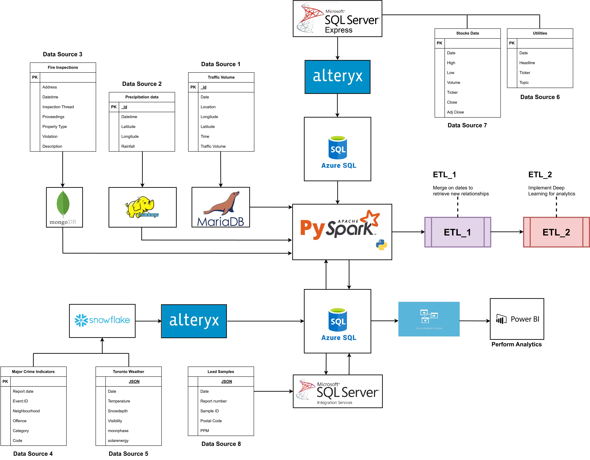

# Toronto_Urban_Dynamics
ETL pipeline design and implementation to explore the relationships between specific characteristics of the city of Toronto, ON

# Data Pipeline (Storage - Data - Source)
1. MariaDB - Traffic Volume - https://open.toronto.ca/dataset/traffic-volumes-at-intersections-for-all-modes/
2. Hadoop - Precipitation Data - https://open.toronto.ca/dataset/rain-gauge-locations-and-precipitation/
3. MongoDB - Fire Inspections - https://open.toronto.ca/dataset/highrise-residential-fire-inspection-results/
4. Snowflake - Major Crime Indicators - https://data.torontopolice.on.ca/datasets/TorontoPS::major-crime-indicators-open-data/about
5. SQL Server Express - StockPrices - Retrieved Nasdaq and sp500 from https://www.alphavantage.co/

# Instructions
To re-create the project you must source all the data into the different data sources mentioned. Each folder contains instructions on how to source the data. The project was using an Azure Database to r/w information.

- Data stored in Snowflake and SQL Server Express was written into Azure Database using an Alteryx pipeline. SSIS and SSAS were used for this project to create a dashboard in PowerBI

# The flow of information has the following logic

